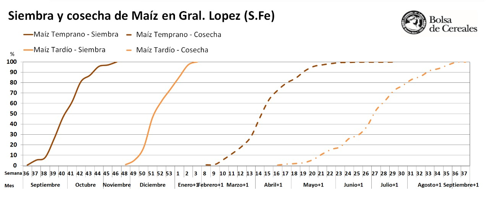
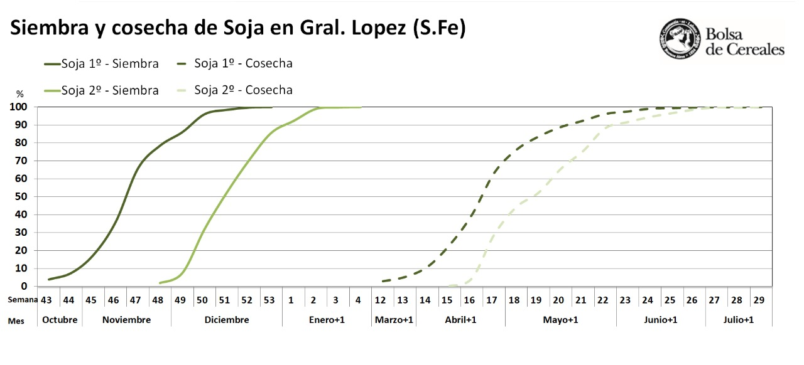

# Desafios AgTech 2020

## Clasificación de cultivos utilizando imágenes satelitales

**Matba Rofex**, **Bolsa de Cereales de Buenos Aires**y **Bolsa de Comercio de Rosario** invitan a clasificar cultivos mediante imágenes satelitales utilizando inteligencia artificial en Argentina.

### Introducción

La agricultura tiene una importancia estratégica en la economía argentina, siendo uno de los países líderes en el mercado mundial de granos, su potencial productivo se manifiesta tanto en la producción primaria como en la agroindustria. Por lo anterior, es importante determinar qué cultivos se están sembrando, no solo para la optimización de políticas públicas y privadas en materia de inversión de recursos económicos, sino también para entender el impacto que estas decisiones tienen, y nuestra responsabilidad, en el cuidado del ambiente. Uno de los insumos fundamentales para estimar la cosecha consiste en salidas a campo, donde a través de la inspección ocular, se registra el tipo de cultivo hallado en cada parcela. Posteriormente, esta **verdad de campo** se utiliza en conjunto con imágenes satelitales para extrapolar el tipo de dato a otras parcelas empleando diversas técnicas de aprendizaje automático.

Debido a la pandemia del COVID-19 las salidas a campo para la obtención de esta información se han visto afectadas, lo cual presenta una gran oportunidad para desarrollar algoritmos que, usando inteligencia artificial en imágenes satelitales, logren clasificar los diversos cultivos en Argentina.

Contar con un método confiable de clasificación remota de cultivos es fundamental en países como Argentina, donde la extensión geográfica dificulta cubrir todas las zonas de interés de modo presencial, por lo cual, la relevancia del desarrollo de estas estas tecnologías se mantiene en campañas futuras, no solo bajo condiciones especiales de pandemia.

Es aquí donde se une la Agricultura con la Tecnología y da nacimiento el término **AgTech.**

### Objetivo

Los participantes deberán construir un método de aprendizaje supervisado que mediante imágenes satelitales y la *verdad de campo* de cosechas previas pueda clasificar cultivos para distintos puntos geográficos del departamento de General López, Santa Fé.

### Oportunidad para los participantes

Los participantes tendrán la oportunidad de trabajar con la **verdad de campo** de cosechas previas que ha sido recolectada por la Bolsa de Comercio de Rosario y por la Bolsa de Cereales de Buenos Aires, y que será abierta de forma exclusiva para esta concurso. Además, se brindarán capacitaciones sobre cómo trabajar con imágenes satelitales para llevar adelante esta y otro tipo de tareas.

### Inscripción

La competencia es libre para todos los que quieran participar. Para inscribirse deberá:

-   Loguearse en Metadata (preferentemente con una cuenta de google).

-   Hacer un submit del archivo [primer\_submit](resultado/first_submit.csv).

### Premios

-   1er puesto: 70 mil pesos

-   2do puesto: 50 mil pesos

-   3er puesto: 40 mil pesos

-   4to puesto: 20 mil pesos

-   5to puesto: 20 mil pesos

Habrá premio a la mejor presentación y otros premios sorpresa que se irán anunciando en el transcurso de la competencia.

### Foro

-   **Slack**, para compartir con otros participantes y despejar dudas: [¡ir a slack!](https://join.slack.com/t/desafios-agtech/shared_invite/zt-iu7s07km-slaD~P0OPlhHjr6OgaDf3Q)

-   **Winn**, para registrarte en los webinars y seguir las novedades: [¡sumarme!](https://bcrwinn.app.link/rw18caVjKab)

### Datos

Para poder trabajar el problema se deberá emplear los tipos de datasets:

1.  **Verdad de campo**. Repositorio en GitHub: <https://github.com/DesafiosAgTech/DesafioAgTech2020>
2.  **Imágenes satelitales**. Amazon Registry of Open Data: <https://registry.opendata.aws/?search=tags:gis,earth%20observation,events,mapping,meteorological,environmental,transportation>

#### Verdad de campo

Se entiende por "*verdad de campo*" a la información obtenida por las Bolsas, quienes todos los años se encargan de realizar salidas a campo para determinar, mediante la inspección ocular, cuáles son los cultivos que están siendo sembrados en los distintos lotes.

#### Imágenes satelitales

Lás imágenes satelitales a utilizarse pueden ser obtenidas de diversas fuentes y queda a cuenta del participante seleccionar la que desee siempre y cuando sea de una fuente gratuita.

Algunas recomendaciones:

-   El satétlite recomendado es el Sentinel o Landsat 7 u 8.

-   Las fechas para las imágenes conviene filtrarlas por los períodos críticos de cada cultivo. Estos están explicados dentro de la descripción del dataset.

Otras links de descarga de imágenes:

-   **Earth Observing System**: <https://eos.com/es/lv/>

-   **Modis** <https://lpdaac.usgs.gov/dataset_discovery/modis/modis_products_table>

-   **Landsat** <https://earthexplorer.usgs.gov/>

-   **Land Cover** <https://ec.europa.eu/jrc/en/scientific-tool/global-land-cover>

-   **Shape Argentina** <http://www.ign.gob.ar/NuestrasActividades/InformacionGeoespacial/CapasSIG>

-   **Modis subset** <https://modis.ornl.gov/cgi-bin/MODIS/global/subset.pl>

-   **Soterlac** <http://data.isric.org/geonetwork/srv/eng/catalog.search#/metadata/ee206a45-4337-4008-8d74-d737b65ba3f0>

### Descripción

Dentro del repositorio de GitHub podrán encontrar una carpeta con el título "dataset", aquí tendrán los siguientes archvos:

-   **Etiquetas.csv**: contiene la descripción del cultivo.

-   **Gral\_Lopez.rar**: contiene el polígono que delimita al departamento de Gral López.

-   **data\_train.csv / data\_test.csv**: contiene el dataset para entrenar el algoritmo y el dataset con los puntos a clasificarse.

#### data\_train.csv / data\_test.csv

Las columnas están organizadas de la siguiente manera:

-   *Id*: Integer - Es el identificador del dataset particular para la salida a campo

-   *Cultivo*: Character - Es el tipo de cultivo que se encuentra en el punto. Estos puntos han sido trasladados manualmente para encontrarse dentro del lote. **¡Objetivo a clasificar!** Debes hacer un submit del CultivoId que se encuentra en Etiquetas.csv. Ver sección evaluación.

-   *Longitud*: Numeric - Coordenada angular.

-   *Latitud*: Numeric - Coordenada angular.

-   *Elevacion*: Numeric - Elevación del terreno.

-   *Dataset*: Character - Proovedor de la verdad de campo. BC: Bolsa de Cereales de Buenos Aires; BCR: Bolsa de Comercio de Rosario.

-   *Campania*: Character - Campaña de la cual ha sido obtenida la verdad de campo. Existen dos campañas: 18/19 y 19/20.

-   *GlobalId*: Integer - Es el identificador global del dataset.

#### Tipos de cultivos

El listado completo de las clases a clasificarse puede encontrarse en el archivo de [Etiquetas.csv](dataset/Etiquetas.csv). La explicación de los más relevantes se expone a continuación:

-   **Soja de primera (S1):** cultivo de soja sembrado sobre barbecho del año anterior.

-   **Soja de segunda (S2):** cultivo de soja sembrado detrás de un cultivo antecesor con fin comercial durante la misma campaña agrícola, por ejemplo: Trigo/Soja 2.

-    **Maíz siembra temprana (Maíz Temp):** maíz sembrado en fecha tradicional de cada zona. Ejemplo: Córdoba y Santa Fe siembras desde septiembre a principios de noviembre.

-   **Maíz siembra tardía + 2° (Maíz Tard o 2DA)**: maíz sembrado en una fecha alternativa, con posterioridad a la fecha tradicional de la zona. Ejemplo: siembras de mediados de noviembre en adelante en Córdoba y Santa Fe corresponden a la categoría de maíz tardío. Dentro de esta categoría también se contemplan las siembras de segunda por compartir similares ventanas de siembra. En este último caso son lotes de maíz sembrados en lotes previamente ocupados con trigo, cebada o cualquier otro cultivo de invierno.

-   **Barbecho:** lote destinado a la siembra de cultivos extensivos que se deja sin [sembrar](https://es.wikipedia.org/wiki/Siembra "Siembra") durante uno o varios ciclos vegetativos. Durante este periodo de tiempo se controlan malezas para dejar el lote limpio de plantas. Su fin es recuperar y almacenar [materia orgánica](https://es.wikipedia.org/wiki/Compuesto_org%C3%A1nico "Compuesto orgánico") y [humedad](https://es.wikipedia.org/wiki/Humedad "Humedad") junto con evitar [patógenos](https://es.wikipedia.org/wiki/Pat%C3%B3geno "Patógeno").

### Evaluación

La calificación de la competencia se logra con el resultado de la clasificación. La métrica elegida para el set de validación es la función de [balance acurracy](https://scikit-learn.org/stable/modules/generated/sklearn.metrics.balanced_accuracy_score.html).

En el tablero se puede ver la evaluación de la solución propuesta en una muestra del set de validación. Esta muestra puede variar durante la competencia. El total del conjunto de datos de validación se reserva hasta el final de la competencia.

Las predicciones se deben submitear utilizando un archivo CSV **sin encabezado** conteniendo en la primer columna el id global (GlobalId) del punto geográfico del dataset de test y en la segunda columna la clasificación del cultivo (CultivoId) correspondiente a punto geográfico. Puede guiarse con el archivo [first\_submit](resultado/first_submit.csv) para orientarse. A continuación, se muestran las primeras filas de un archivo de predicciones típico:

GlobalId, CultivoId

2, 6

8, 7

11, 6

Los participantes que se encuetren en los primeros puestos del ranking deberán, además de subir el CSV a la web de Meta:Data, enviar el link al fork que hayan realizado de este repositorio en dónde se vislubre dentro de la carpeta "resultado" el informe reproducible junto con el CSV previamente enviado al sitio. Este informe será revisado por un jurado de notables, quienes eligirán las mejores presentaciones.

Serán motivos de descalificación:

-   Entregas que hayan usado una técnica de observación visual manual para la clasficación de los cultivos.

-   Entregas cuyo CSV del repositorio no se condiga con el CSV entregado en Meta:Data

Las soluciones que se consideren tramposas serán detectadas y quedarán descalificadas.
